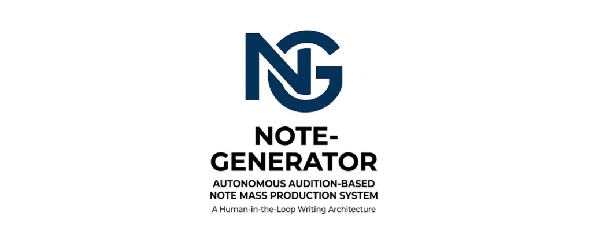
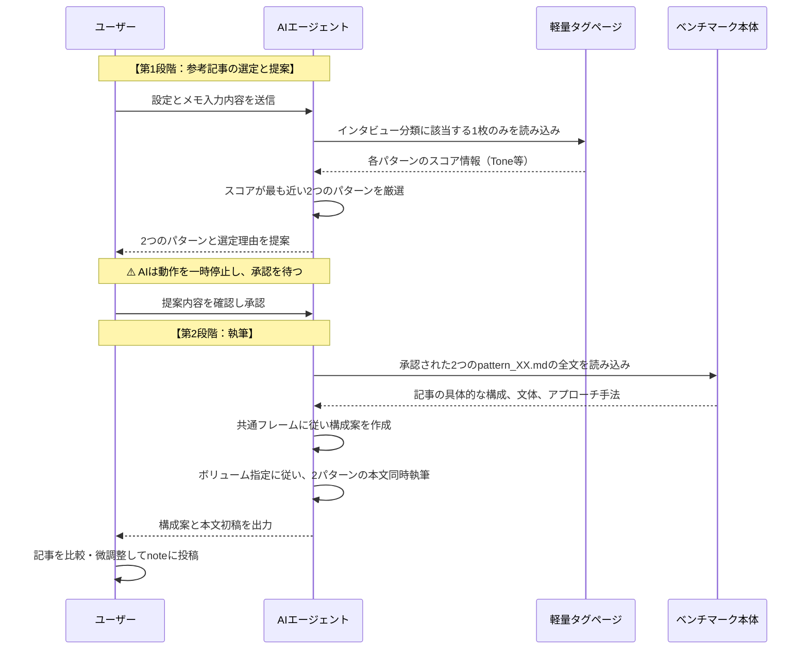

# 自律オーディション型 note量産システム 仕様書


## 1. プロジェクト概要 (Overview)
このシステムは、AI（Cursor等のLLMエージェント）を活用して、属人性の高い高品質なnote記事を「安定した品質」で「量産」するための執筆支援アーキテクチャです。
ユーザーが入力した「断片的なメモ」や「構成の定まっていないテーマ」に対して、事前に定義された50パターンの「良質なベンチマーク記事」の中から最適な文体・構成をAIが自動選定し、2通りのプロトタイプを提案・執筆します。

本システムの最大の特徴は、**「タグページ分離によるトークン節約」** と **「提案と執筆の2段階プロセス」** による、AIのコンテキスト希薄化防止と人間によるコントロール（Human-in-the-loop）の両立です。

---

## 2. システムアーキテクチャ (Architecture)

### 2.1 ディレクトリ構成
```text
note-generator/
│
├── .cursorrules               # システム全体の共通思想・AIの人格・基本トーン定義
├── .markdownlint.json         # CI/CD用のMarkdownフォーマット制限解除設定
├── README.md                  # 本仕様書
│
├── benchmarks/                # ベンチマーク・ナレッジベース
│   ├── index.md               # 50パターンの全要約リスト（人間用）
│   ├── tags_interview_1.md    # [自動生成] 非インタビュー記事のタグ一覧
│   ├── tags_interview_2.md    # [自動生成] インタビュー（一人称）記事のタグ一覧
│   ├── tags_interview_3.md    # [自動生成] インタビュー（三人称）記事のタグ一覧
│   ├── pattern_01.md          # 抽出された神記事の構造・文体分析（全50ファイル）
│   │   ...
│   └── pattern_50.md
│
├── context/                   # 企業文化や前提知識の定義
│   ├── culture_and_mission.md # BASE/JBAのミッション、求める人物像、思想
│   └── tag_definition.md      # 各種パラメータ・タグの定義詳細
│
└── templates/                 # 実行用プロンプトテンプレート
    └── auto_audition_writer.md # 実稼働用プロンプト（コントロールパネル）
```

### 2.2 主要コンポーネントの役割
- **`.cursorrules`**: AIのアイデンティティ（知性的、オープン、ロジカル、熱量が高い編集者）と、絶対的な執筆ルール（誇張表現の禁止、スマホ可読性など）を強制するグローバルルール。
- **`benchmarks/pattern_XX.md`**: 模倣すべき記事の「構造（目次、導入手法）」「文体（主観、感情温度）」「システム用スコア」が記述されたファイル。本文生成時の「型」となる。
- **`tags_interview_X.md`**: AIが50記事全てを読み込むとトークンを大量消費し精度が落ちるため、AIが「選定（オーディション）」にのみ使う軽量化されたメタデータリスト。
- **`templates/auto_audition_writer.md`**: ユーザーがチャットに入力するメインプロンプト。AIへの具体的な動作指示と、ユーザーが要件を入力する「コントロールパネル」を含む。

---

## 3. 業務フロー (Workflow)

このシステムは「ユーザー（人間）」と「AIエージェント」の協働によって動作します。

### 3.1 全体フロー図



---

## 4. 各フェーズの詳細な動作仕様

### 4.1 ユーザーの準備（インプット）
ユーザーは `templates/auto_audition_writer.md` を開き、末尾のコントロールパネルを埋めます。
コントロールパネルでは、各項目の「設定値（1〜5など）」を `【  】` の中に入力します。

*   **インタビュー**: `1`(非インタビュー) / `2`(インタビュー一人称) / `3`(インタビュー三人称)
*   **トーン**: `1`(硬派) 〜 `5`(親しみ)
*   **専門性**: `1`(平易) 〜 `5`(専門)
*   **熱量**: `1`(分析) 〜 `5`(情熱)
*   **フォーカス**: `1`(思想) 〜 `5`(実践)
*   **ボリューム**: `1`(5,000字超) 〜 `5`(1,000字程度) （※出力文字数の指定であり、パターンの選定基準には影響しません）
    *   1〜5のスケールに当てはまらない厳密な文字数指定がある場合は、`（範囲外の要望：　字）` に数値を入力します。AIはこれを最優先します。
*   **核心・インプット**: 伝えたいメッセージの結論や、箇条書きのメモ、インタビューのトランスクリプトを記述。

### 4.2 第1段階：AIによる「オーディションと提案」
AIは入力された `インタビュー` の数値を見て、`benchmarks/` 内の対応する **1枚のタグページだけ** を読み込みます。
（例：`インタビュー: 1` なら `tags_interview_1.md` のみを読む）

他の4つのパラメータ（トーン・専門性・熱量・フォーカス）の距離・近似値から、最もスコアが合致するパターンを **2つ** 見つけ出し、ユーザーに対して提案を行います。

> **AIの出力イメージ:**
> 「設定されたスコアに基づき、以下の2パターンを提案します。
> 1. パターン05（Tone:2, Expertise:4...が合致）
> 2. パターン12（Focus:1, Energy:5...が合致）
> こちらの2つを参考にして執筆に進んでもよろしいでしょうか？」

### 4.3 第2段階：AIによる「構成案と本文の執筆」
ユーザーが「OK」を出した後、AIは選ばれた2つの `pattern_XX.md` の全文を読み込み、具体的な文体や展開の仕方を学習します。

その後、`culture_and_mission.md` などのコンテキストに基づきながら、以下のフォーマットで出力します。
1. **構成案（パターンA / パターンB）**
    *   導入（フック）
    *   WHY（背景・課題）
    *   HOW（具体策・プロセス）
    *   FUTURE（未来・実力向上への着地）
2. **本文初稿（パターンA / パターンB）**
    *   指定された `ボリューム` の長さに合わせて執筆。

---

## 5. 本システムの保守・拡張ルール
- **新しいベンチマークの追加**: 新しい「神記事」を見つけた場合は、`pattern_51.md` として追加し、メタデータとシステムタグを付与してください。その後タグページを再生成することで、自動的にAIの選定候補に加わります。
- **CI/CD管理**: 本リポジトリのMarkdownファイル群は、厳密なフォーマットチェック（Lint）の対象外としています（`.markdownlint.json`で制御）。Markdownファイルはドキュメントとしてだけでなく「AIへの構造化された入力データ」としての役割を優先するためです。


## 6. 本システムの今後の方針
- **RAGへの進化**: 現状の参考記事の選定フローはベクトルDBに近い考え方を用いています。（完全に一致はしませんが）ここから今後はRAGへと本格的に進化させ、より参考記事の選定フローを改善します。
- **ライティングについて**:現状ではライティングに関して詳細な対策ができていないので、参考記事をどうやったらさらに生かせるか、人が読んでよいと感じる記事を作成するにはどうすべきかは追々考えていきます。
